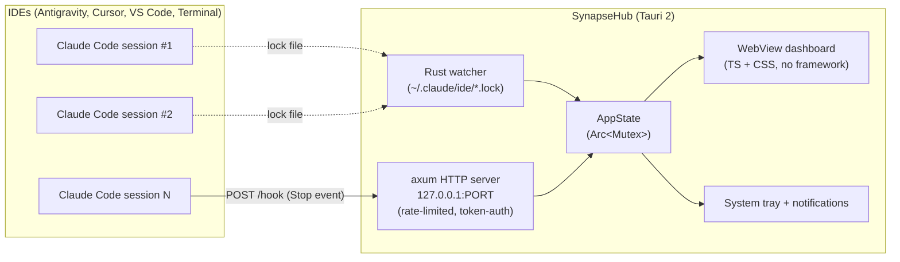

<div align="center">

# SynapseHub

**Cross-platform agent operations desk for Claude Code**

*Stop losing track of which agent is waiting for you.*

[](https://github.com/thierryvm/SynapseHub/releases/latest)
[](https://github.com/thierryvm/SynapseHub/actions/workflows/release.yml)
[](LICENSE)
[](https://tauri.app)
[](https://www.rust-lang.org)
[](https://www.typescriptlang.org)

[**Download**](#-download) · [**Quick start**](#-quick-start) · [**Architecture**](#-architecture) · [**Roadmap**](#-roadmap) · [**Contributing**](CONTRIBUTING.md)

</div>

---

## ✨ The problem SynapseHub solves

When you run **multiple Claude Code sessions** across Antigravity, Cursor, VS Code, or a plain terminal, you lose track of which agent is doing what — and worse, **which one is waiting for your input**.

Standard OS notifications only fire when the IDE window is in the foreground. So if you're working in another window, an agent that's waiting on you can sit idle for minutes — or hours.

**SynapseHub fixes that.** It lives in your system tray, watches all your active Claude Code sessions, and sends a native OS notification the moment any of them needs your attention — no matter which window is focused.

> [!NOTE]
> **v0.1.1 is the first public release.** Functional MVP, core security hardening done, but the auto-updater pipeline is being repaired in v0.1.2 ([#17](https://github.com/thierryvm/SynapseHub/issues/17)). For now, install manually from the [release assets](https://github.com/thierryvm/SynapseHub/releases/latest). UX/UI rework planned for v0.2.0.

---

## 🎯 Features

- **Live agent dashboard** — every active Claude Code session at a glance: project name, git branch, IDE host, running time
- **Waiting-for-input detection** — highlights agents that have hit Claude Code's `Stop` hook
- **Cross-window OS notifications** — native alerts via `tauri-plugin-notification`, regardless of which app is focused
- **One-click window focus** — click an agent card and the IDE window jumps to the front
- **System tray native** — runs quietly in the tray, starts with the OS, near-zero footprint
- **Privacy by default** — 100% local. No telemetry. No cloud. The HTTP server only listens on `127.0.0.1`
- **Cross-platform** — Windows (MSI/EXE), macOS Intel + Apple Silicon (DMG), Linux (.deb / AppImage)
- **Hardened security baseline** — timing-safe token comparison, 64-char hex entropy, rate-limiting on the hook endpoint, file perms `0600` on Unix, hard `cargo audit` gate in CI

---

## 📦 Download

Get the latest binaries from [**GitHub Releases**](https://github.com/thierryvm/SynapseHub/releases/latest).

| Platform | Format | Notes |
|---|---|---|
| 🪟 Windows 10/11 | `.msi` (recommended) or `.exe` | Bundled installer, native tray |
| 🍎 macOS 13+ Apple Silicon | `.dmg` | M1/M2/M3 optimized |
| 🍎 macOS 13+ Intel | `.dmg` | x86_64 build |
| 🐧 Linux (Debian/Ubuntu) | `.deb` | Tested on Ubuntu 22.04+ |
| 🐧 Linux (other distros) | `.AppImage` | Portable, no install needed |

Each release ships **9 binaries** built and (OS-) signed by GitHub Actions. macOS notarization and Windows signtool integration are handled by `tauri-action`.

---

## 🚀 Quick start

### 1. Install SynapseHub

Download the binary for your OS from [Releases](https://github.com/thierryvm/SynapseHub/releases/latest) and install. The app starts in your **system tray** (look for the icon — top-right on macOS, bottom-right on Windows, top-bar on most Linux DEs).

### 2. Configure the Claude Code hook

SynapseHub listens for Claude Code's `Stop` hook on a local-only HTTP endpoint, so it can detect when an agent is waiting for input.

Open **Settings → Hook setup** in the SynapseHub UI to get the exact `settings.json` snippet to paste into your Claude Code config (with a freshly-generated 64-char hex token).

A typical project-level hook looks like:

```json
{
  "hooks": {
    "Stop": [{
      "type": "command",
      "command": "curl -X POST http://127.0.0.1:8765/hook -H 'X-SynapseHub-Token: <your-token>' -H 'Content-Type: application/json' -d '{}'"
    }]
  }
}
```

> Full instructions including PowerShell helper, project-level vs user-level paths, and troubleshooting: [`docs/hook-setup.md`](docs/hook-setup.md).

### 3. Launch your agents

Run Claude Code as usual in any IDE. SynapseHub picks them up automatically and shows them in the dashboard. When an agent finishes a task and waits for input, you'll get a native OS notification with one-click focus.

---

## 🏗 Architecture



Two complementary signals feed the same `AppState`:

1. **Lock file polling** (every 2s) — detects which Claude Code sessions are alive, on which project, branch, and IDE
2. **HTTP webhook** — fires when a session hits a `Stop` hook (i.e. waiting for user input)

The HTTP server only binds to `127.0.0.1` — never exposed to the network. All `/hook` requests are token-authenticated (timing-safe comparison) and rate-limited to 10 req/s.

---

## 💻 Development

### Prerequisites

- **Node.js** 20.x+ (LTS recommended)
- **Rust** 1.80+ (`rustup`)
- **Platform-specific Tauri prerequisites** — see the [Tauri prerequisites guide](https://tauri.app/start/prerequisites/)
- **Claude Code** installed (for end-to-end testing)

### Setup

```bash
git clone https://github.com/thierryvm/SynapseHub.git
cd SynapseHub
npm install

# Run in dev mode (hot-reload UI + watch Rust)
npm run tauri dev

# Run TS + Rust tests
npm test                 # vitest (frontend)
cargo test --manifest-path src-tauri/Cargo.toml

# Production build
npm run tauri build
```

### Project layout

```
src/                  # TypeScript + CSS frontend (no framework)
src-tauri/
  src/                # Rust backend (axum, sysinfo, git2)
  Cargo.toml          # Rust deps + targets
  tauri.conf.json     # App config (bundles, updater, capabilities)
  audit.toml          # cargo audit ignores (with rationale + GitHub trackers)
docs/                 # User docs (hook setup, etc.)
.github/workflows/    # CI: lint, tests, release matrix (4 OS)
scripts/              # Build helpers (icon generation, etc.)
```

See [`SETUP.md`](SETUP.md) for the full developer onboarding guide and [`AGENTS.md`](AGENTS.md) for codebase conventions.

---

## 🔒 Security

Security is treated as a first-class concern, not an afterthought.

- **Token-based auth** on the `/hook` endpoint with **timing-safe comparison** (`subtle::ConstantTimeEq`)
- **64-char hex entropy** for tokens (`OsRng`)
- **Rate-limited** at 10 req/s via `tower_governor`
- **File permissions `0600`** on `hook_token` (Unix)
- **Server bound to `127.0.0.1` only** — never exposed to LAN
- **`cargo audit` hard gate in CI** — release blocked on any unfixed advisory
- **Documented advisory ignores** in `src-tauri/audit.toml` — every ignore has a rationale + a GitHub tracker issue with a clear exit condition

For the full security posture, threat model, and supply-chain controls, see [`SECURITY.md`](SECURITY.md).

To responsibly report a vulnerability, please follow the disclosure process described in `SECURITY.md`.

---

## 🗺 Roadmap

| Version | Focus | Status |
|---|---|---|
| **v0.1.1** | Public release — security hardening, ergonomics, CHANGELOG | ✅ Released 2026-04-29 |
| **v0.1.2** | Auto-updater pipeline fix + UX (toast, manual check, restart) + sécurité Tier 4 | 🚧 In progress |
| **v0.2.0** | Trio integration — generic webhook `POST /notify`, generic folder watcher (Obsidian vault), focus Cowork desktop | 📋 Planned |
| **v0.3.0** | UX/UI global rework, multi-monitor support, custom notification sounds | 💡 Conceptual |
| **v1.0.0** | Stable plugin API for community extensions | 🎯 Goal |

Full roadmap and current sprint priorities: see [open milestones](https://github.com/thierryvm/SynapseHub/milestones) and [v0.1.2-candidate issues](https://github.com/thierryvm/SynapseHub/issues?q=is%3Aopen+label%3Av0.1.2-candidate).

---

## 📚 Documentation

| Document | Purpose |
|---|---|
| [`SETUP.md`](SETUP.md) | Full developer onboarding (prereqs, build, test, troubleshoot) |
| [`docs/hook-setup.md`](docs/hook-setup.md) | Configure the Claude Code `Stop` hook (project-level, user-level, PowerShell helper) |
| [`docs/release-process.md`](docs/release-process.md) | End-to-end release workflow (sanity checks, tagging, monitoring, rollback) |
| [`AGENTS.md`](AGENTS.md) | Codebase conventions and module-by-module guide for AI coding agents |
| [`CONTRIBUTING.md`](CONTRIBUTING.md) | Branch strategy, commit conventions, PR checklist |
| [`SECURITY.md`](SECURITY.md) | Security posture, threat model, vulnerability disclosure |
| [`CHANGELOG.md`](CHANGELOG.md) | Versioned change log (Keep a Changelog 1.1.0) |

---

## 🤝 Contributing

Contributions are welcome. Bug reports, feature requests, and pull requests all help.

1. **Bug reports** — please use the [bug report template](https://github.com/thierryvm/SynapseHub/issues/new?template=bug_report.md)
2. **Feature requests** — [feature request template](https://github.com/thierryvm/SynapseHub/issues/new?template=feature_request.md)
3. **Pull requests** — read [`CONTRIBUTING.md`](CONTRIBUTING.md) first; small, atomic, well-tested PRs preferred

All PRs are reviewed and must pass the full CI matrix (lint, TypeScript check, Rust tests, Vitest, `cargo audit`) before merge.

---

## 📝 License

[MIT](LICENSE) — © 2026 Thierry Vanmeeteren

---

<div align="center">

**Built with [Tauri 2](https://tauri.app), [Rust](https://www.rust-lang.org), and a lot of `cargo audit` runs.**

[Report an issue](https://github.com/thierryvm/SynapseHub/issues) · [Latest release](https://github.com/thierryvm/SynapseHub/releases/latest) · [Discussions](https://github.com/thierryvm/SynapseHub/discussions)

</div>
